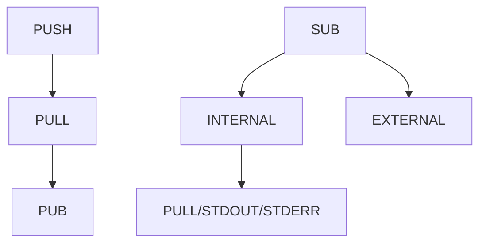

# Changer

---
Changer is a patchbay for data processing.

## Run
changer -h | --help

## Path

## PULL
The purpose to the PULL service if to take in data. If a `regex` is set then it is applied to the data to attempt a conversion to json. The `regex` should be a written to capture names which allows the conversion to json. If `regex` is not set then the data is passed unprocessed.
A unique ID is generated and added to the next chain in the processing pipeline which is passed to next receiver defined in `dst`.
### How to format messages
Create a zmq::PUSH socket and connect it to Changer's PULL socket.  The send multipart messages as described below.
#### New Data
Send two frame message where frame 1 is topic name and frame 2 is the data.

`[topic_name, data]`
#### Ack Data
Send two frame message where frame 1 is `changer.ack` and frame 2 is the message id.

`[changer.ack, message_id]`
#### Pipeline Data
Send three frame message where frame 1 is topic name, frame 2 is message id and frame 3 is the data.

`[topic_name, message_id, data]`
## Rules
```yaml
pull:
    - src: src1
      regex: ^(?P<name>.*)$
      dst: src2
    - src: src2
      regex: ^(?P<doop>.*)$
      dst: src3
    - src: src3
      regex: ^(?P<poop>.*)$
      dst: src4
```

## Destinations
Destinations defined by `dst` is the next sequence in the pipeline that the data will be passed to.  If there is no `dst` defined the processing pipeline will acknowledge that the processing for the data is complete.
## Built In Destinations
* changer.stdout
* changer.stderr

If the either of the above destinations are used `changer` with output results of the data processing pipeline to `stdout` or `stderr`.
###example: stdout
```yaml
pull:
    - src: src1
      regex: ^(?P<name>.*)$
      dst: changer.stdout
```

## External Processing
Adding external processor is very easy.  Create a zmq::SUB socket and connect it to Changer's PUB socket.  Then add a subscription to a topic name that is unique for the processor.  This topic can then be set as a `dst` in the rules file to data is passed to the external processor.
If you want to send it back to Changer for further processing Create a zmq::PUSH socket and connect it to Changer's PULL socket. See message formatting for send and receive expectations.
If the external processor is the end of the pipeline it should send an ACK to Changer to let it know that the processing of the original incoming data is finished. See PULL section for how to send Ack data.